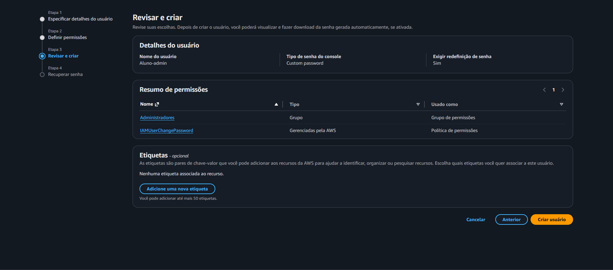
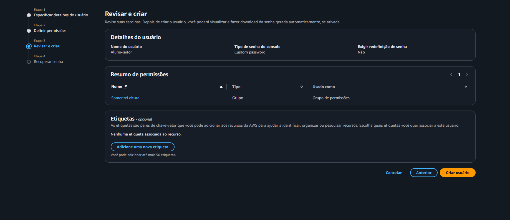

# Relatório: Pequena bagunçinha na AWS

**Equipe:**
Victor Gabriel 
Thiago Uchôa 
Enzo Souto

**Matéria:** Computação em Nuvem / Infraestrutura

---

## 1. Grupos e Políticas Criados
Foram criados os grupos de usuários conforme solicitado, aplicando as políticas padrão da AWS para segregação de funções.

* **Grupo Administradores:** Vinculado à política `AdministratorAccess`.
* **Grupo SomenteLeitura:** Vinculado à política `ReadOnlyAccess`.

## 2. Usuários e Vínculos
Os usuários foram criados e inseridos em seus respectivos grupos de segurança, garantindo o princípio do menor privilégio:

* `aluno-admin` -> Grupo `Administradores`
* `aluno-leitor` -> Grupo `SomenteLeitura`

---

## 3. Evidências do Laboratório

### Print : Configuração do Usuário Administrador

### Print : Configuração do Usuário Leitor

---

## 4. Importância da Separação de Permissões 
A divisão de permissões no IAM é uma das principais boas práticas de segurança em nuvem. Não faz sentido usar a conta Root ou permissão de Admin para tarefas comuns, já que um erro bobo pode deletar recursos críticos. Criando um perfil de leitura (ReadOnlyAccess) para quem só precisa visualizar o painel, a gente reduz o raio de ação de um possível problema. Se a conta for invadida ou o operador errar o comando portanto a infraestrutura fica protegida porque o usuário não tem permissão para modificar ou deletar nada.

